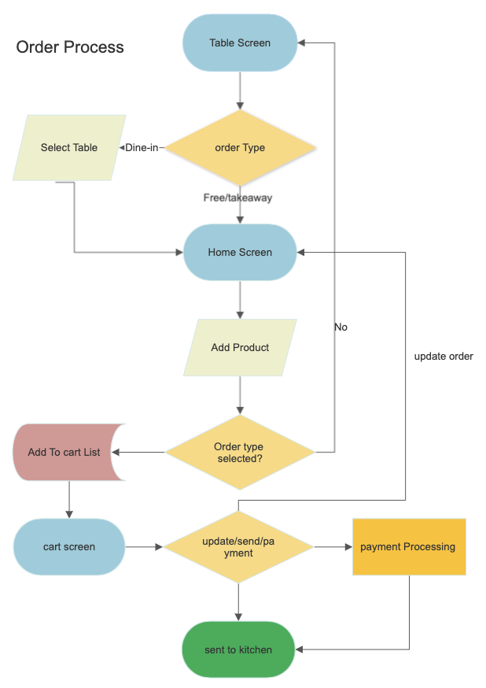

**App Name: Emenu Light APP**

RN Version: 0.71.4

Pakager: Yarn

Android Bundle Identifier: com.emenuapp_pk

**Introduction** to application:

eMenu Light app, a mobile Point of Sale (POS) app designed to make ordering and payment processes

easier and more convenient. The app's core functionality includes a mobile POS system that allows

waiters to manage orders and payments from a single device.

With the eMenu Light app, waiters can easily add products to a cart by selecting them from a list of

available items. They can also delete products from the cart if needed. The app supports multiple product

categories, which allows waiters to apply discounts to specific categories. This makes it easier for

businesses to process orders quickly and efficiently, without the need for a traditional cash register.

The app also allows waiters to hold orders and offer free orders, which can be sent directly to the kitchen

for preparation. This is useful for businesses that want to offer special deals or promotions to their

customers. The eMenu Light app supports various payment types, including cash, card, and custom

payments. This allows businesses to cater to a variety of customers with different payment preferences.

Additionally, the eMenu Light app can be connected to Sunmi and Star printers via Bluetooth, making it

easy to print receipts for customers. This is a convenient feature that eliminates the need for separate

receipt printers.

Overall, the eMenu Light app is a powerful tool for businesses that want to streamline their order and

payment processes. Its intuitive interface and robust features make it an excellent choice for restaurants,

cafes, and other businesses that rely on quick and efficient order management. With the eMenu Light app,

managing orders and payments has never been easier!

**Login Screen:**

1\. Open the eMenu Light app on your mobile device.

2\. The Login Screen will appear, prompting you to enter your email and password.

3\. Enter your email and password in the designated fields.

4\. Click on the "Login" button.

5\. The app will authenticate your email and password to ensure that you have access to the app.

6\. If the authentication is successful, you will be redirected to the Table screen.

7\. From the Table screen, you can view and manage the tables in your establishment.

**Flow Diagram:**

**Forgot Password Screen:**

1\. On the Login Screen, click on the "Forgot Password" button.

2\. The app will prompt you to enter your email address.

3\. Enter your email address in the designated field.

4\. Click on the "Submit" button.

5\. The app will authenticate your email address to ensure that it is valid.

6\. If the email address is valid, the app will send a forgot password link to the given email account.

7\. Check your email account for the forgot password link.

8\. Click on the link to reset your password.

9\. Follow the on-screen instructions to reset your password.

10\. Once you have reset your password, you can log in to the eMenu Light app using your new

password.

**Flow diagram:**

**Table Screen:**

Table Screen of the eMenu Light app with the added functionality of selecting a table for dine-in orders:

1\. The user is presented with the Table Screen after logging in to the app.

2\. The user is given two order types to choose from: "Take Away" or "Dine-In".

3\. If the user selects "Dine-In", the app will display a table arrangement section based on categories

such as "Outdoor", "Indoor", "Floor", etc.

4\. The user can select a specific table from the table arrangement section.

5\. If the user wants to search for a table, they can use the search function to find a table based on

table number.

6\. Each table will be shown as either "Busy" or "Free".

7\. If the user selects a "Busy" table, the app will take them to the Cart Screen and load the currently

selected table's order.

8\. If the selected table's order is already paid, the user can long press the table to release it and

make it available for new orders.

9\. Once the user has selected a table for their dine-in order, they can proceed to the Home Screen

to select products and complete the order.

10\. If the user selects "Take Away" as their order type, they can proceed directly to the Home Screen

without selecting a table.

**Home Screen:**

Following functionality of Home Screen:

1\. The user is presented with the Home Screen after selecting a table for dine-in orders.

2\. The main categories are displayed on the Home Screen.

3\. If the user taps a main category, the app will display the top-level categories within that main

category.

4\. If the user taps a top-level category, the app will display the subcategories and products within

that category.

5\. If the user taps a subcategory, the app will display the products within that subcategory.

6\. If the user selects a product, a card will be shown on the screen with the selected product details.

7\. If the user taps the same product again, the quantity of that product will increase.

8\. From the selected item, an edit icon will be shown.

On press edit icon, a bottom model will open displaying selected product features:

Instructions

Comments

Ingredients to remove

Extra ingredient

Offer

Delete

Display discount for the whole cart

9\. If the user taps the "Offer" option, an offer model will display where the user can select how many

quantities they want for free.

10\. If the user taps the "Instructions" option, any instructions for the selected product will be

displayed.

11\. If the user taps the "Comments" option, any comments for the selected product will be displayed,

and the user can also add a custom comment.

12\. If the user taps the "Ingredients to Remove" option, they can select which ingredients they do not

want to include in the selected product.

13\. If the user taps the "Extra Ingredient" option, they can select any additional ingredients they want

in the selected product.

14\. If the user taps the "Delete" option, the selected product will be removed from the cart.

15\. If the user taps the "Discount" option, the app will display discount options by main category, for

the whole cart, or by a fixed amount.

16\. The top header of the Home Screen displays the "Back" button, "Home" button, and "Clear Cart"

button.

17\. If the user taps the "Back" button, they will return to the previous screen step by step.

18\. If the user taps the "Home" button, they will be directed to the Home Screen main category

directly.

19\. If the user taps the "Clear Cart" button, the cart will be emptied of all selected items.

**Cart Screen:**

1\. The Cart screen is enabled when at least one product is added to the cart.

2\. The order details are displayed on the Cart screen. This includes all the selected products, any

applied offers, and the total cost of the order.

3\. A "Send Order" button is displayed on the Cart screen. This is used to send the order to the

kitchen.

4\. A dropdown menu of payment options is displayed when the "Pay" button is pressed. The user

can choose the payment method from the list of options.

5\. A model is displayed with the details of the selected payment method. This includes the payment

amount, the payment gateway details, and the confirmation button.

6\. Once the payment is processed, the "Order Sent" button is displayed.

7\. If the order was made for a dine-in table and the table was marked as busy, the "Released Table"

button will be displayed.

8\. If the user wants to place a new order, they can tap on the "New Order" button.

**Functions Screen:**

1\. **Pause or Hold Order:** This feature allows the user to pause or hold an order for a specific table.

The user can select the table number from the list of tables and then pause or hold the order.

2\. **Cash out:** TThis feature is not working yet..

3\. **Ticket or Get Paid Order List:** This feature displays a list of all the orders that have been paid

for. The user can select an order from the list and view its details, such as the table number, order

items, and payment information.

4\. **Tip:** This feature allows the user to add a tip to the order. The user can select the order from the

list of paid orders and then add a tip amount.

5\. **Note:** This feature is not working yet..

6\. **Move Order to Another Table:** This feature allows the user to move an order from one table to

another. The user can select the order from the list of active orders and then select the new table

number to move the order to.

7\. **Scan:** This feature is not working yet..

**Applications screen:**

1\. **Research:** This feature is not working yet.

2\. **Reservation:** This feature is not working yet.

3\. **Partner:** This feature is not working yet.

4\. **Delivery:** This feature is not working yet.

5\. **Ordered:** This feature is not working yet.

6\. **Click & Collect:** This feature is not working yet.

7\. **Call by customer to waiter:** Displays a list of all the tables that have requested assistance from

the waiter. The table number, time of request, and reason for request will be shown.

8\. **Takeaway or Carry-out order list:** This feature displays a list of all the orders that are to be

taken away or carried out.

**Setting screen:**

1\. **Client:** This feature is not yet working.

2\. **Table:** On clicking this option, the user will be taken to the table screen, where they can view and

manage the tables in the restaurant.

3\. **Reservation:** This feature is not yet working.

4\. **Statistical:** This feature is not yet working.

5\. **Connect printer:** On clicking this option, the user will be taken to a native module where they

can add a printer to the system.

6\. **Menu:** This feature is not yet working.

7\. **Report:** This feature is not yet working.

8\. **Language:** The user can select between English or French as their preferred language.

9\. **Logout:** On clicking this option, the user will be logged out of the application and taken to the

login screen.

**Main Functionality of Emenu:**

1\. **Dine-in order:** The customer can view the menu on a tablet or digital device and place an order

for food and drinks while dining in the restaurant.

2\. **Takeaway order:** The customer can also place an order for food and drinks to take away.

3\. **Offer on product:** The application can display offers and promotions on certain products, which

can be applied automatically to the order.

4\. **Discount:** The application can provide discounts on the total order amount based on certain

conditions such as order value, number of items, etc.

5\. **Hold order:** The application can provide an option to hold an order temporarily if the customer

needs to leave the table for a while.

6\. **Move table:** The application can provide an option to move the order from one table to another in

case of table changes.

7\. **Send order to kitchen:** The application can send the order directly to the kitchen for preparation

once it is placed.

8\. **Payment:** The application can provide various payment options to the customer, such as cash,

card, mobile payments, etc.

9\. **Printer:** The application can connect to a printer to print receipts, kitchen orders, etc.

**Order Processing Flow Diagram:**

1\. From the Table screen, select the order type (dine-in or takeaway).

2\. If takeaway is selected, go to the Home Screen.

3\. If dine-in is selected, select the table from the Table screen and go to the Home Screen.

4\. On the Home Screen, select the products from the available categories and add them to the cart.

5\. If the order type was not selected previously, the user will be prompted to select the order type

before adding products to the cart.

6\. On the Cart Screen, review the order details and make any necessary changes, such as adding

or removing products, increasing or decreasing quantities, or applying any available offers or

discounts then return to the Home screen.

7\. After reviewing the order, the user can update the order and return to the Cart Screen to continue

,send the order to the kitchen or proceed to payment.

8\. If the user chooses to send the order to the kitchen, the kitchen will receive the order for

preparation.

9\. If the user chooses to proceed to payment, they will be prompted to select a payment method,

such as cash or credit card, and enter any necessary payment details.

10\. After payment is successfully processed, the order will be sent to the kitchen for preparation.

**Offer on product or extra ingredient:**

An offer is a promotional activity that allows you to provide free quantities of a product or extra ingredient

to the customer. For example, if a customer orders a product , if a product has a quantity of 5, and you

offer 3 free quantities, then the customer will only be charged for 2 quantities of that product.

To apply an offer on a product or extra ingredient, follow these steps:

1\. Press on the edit icon of the product or extra ingredient you want to apply the offer to.

2\. A bottom modal will appear, select "Offer" from the options.

3\. An offer modal will appear, where you can select the number of free quantities you want to give

away.

4\. Press "Done" to apply for the offer.

5\. A copy of the product/extra ingredient with the specified number of free quantities will be added to

the cart.

Please note that the quantity specified in the offer should not be greater than the quantity of the

product/extra ingredient.

**Discount:**

Discount is a reduction in the price of a product or service. In the eMenu application, there are different

types of discounts that can be applied.

The first type of discount is based on Category. This means that if a discount is applied to a category,

then the discount will be applied to all the products that belong to that category.

The second type of discount is a global discount. This means that if a global discount is applied, then the

discount will be applied to all products in the cart, regardless of their category.

The third type of discount is Rabais. Rabais is a fixed amount that is applied to the cart total. For

example, if a Rabais of $10 is applied, then $10 will be deducted from the total amount of the order.

Discounts are usually represented as a percentage of the original price. However, this is not the case for

Rabais. Rabais is a fixed amount and is not a percentage.

To apply discount in the eMenu application, follow these steps:

1\. Press the edit icon of any product to apply the discount.

2\. A bottom modal will appear. From there, select the "Discount" option.

3\. Different discount types will be displayed. Choose the type of discount you want to apply, such as

main categories, global, or Rabais.

4\. Enter the discount value and apply to it.

Note that after applying the discount, the user will not be able to update the cart.

**Hold order:**

Hold order is a feature in an e-menu application that allows customers to pause or temporarily stop their

current order and come back to it later. This is particularly useful if the customer needs to leave the

restaurant for any reason, but still wants to complete their order when they return.

Here are the step-by-step instructions for holding an order:

1\. Add at least one product to the cart.

2\. Ta p the "More" button in the bottom navigation bar.

3\. In the "More" screen, select the "Function" tab at the top.

4\. Look for the "Hold" icon and click on it.

5\. A message should appear indicating that the order has been successfully held.

**Note:** It's important to note that the hold order feature is typically only available for dine-in orders, as

takeout or delivery orders are usually expected to be completed in a single transaction

**Move table**

The application can provide an option to move the order from one table to another in case of table

changes

**1. Move Order to a Free Table:** This action involves moving the entire order from a table that is currently

occupied to another table that is currently available or unoccupied. To move the order to a free table, the

following steps can be followed:

1\. Select the table to which you want to move the order.

2\. Press the "More" option from the bottom tab.

3\. Go to the function screen and press the "Table Move" icon.

4\. This will take you to the table screen.

5\. Select any free table to move the order to.

6\. The order will then be successfully moved to the selected table.

**2. Move Order to an Already Busy Table:** This action involves moving the entire order from a table that

is currently occupied to another table that is also currently occupied by another order. In this case, there

are two options:

Marge Order

Split order

**Merge Orders:** This option allows you to combine two or more orders that are currently on separate

tables into one single order. This is useful when two or more parties want to combine their orders or when

one party wants to join another party at a different table. To merge orders, follow these steps:

1\. Go to the table where the orders are currently placed.

2\. Press on the "More" option from the bottom tab.

3\. Go to the function screen and select the "Table Move" icon.

4\. It will take you to the table screen where you can see all the tables.

5\. Select the table where you want to move the orders.

6\. A pop-up will appear, asking whether you want to "Merge" or "Split" the orders.

7\. Select the "Merge" option to combine the orders from the current table with the orders on the

selected table.

8\. Confirm the merge by pressing the "Merge Orders" button.

9\. The orders will be successfully merged to the new table.

**Split Order**: This option allows you to separate one order into two or more orders and move them to

different tables. This is useful when a large party wants to separate into smaller groups or when one party

wants to move to a different table. To split an order, follow these steps:

1\. Go to the table where the orders are currently placed.

2\. Press on the "More" option from the bottom tab.

3\. Go to the function screen and select the "Table Move" icon.

4\. It will take you to the table screen where you can see all the tables.

5\. Select the table where you want to move the orders.

6\. A pop-up will appear, asking whether you want to "Merge" or "Split" the orders.

7\. Select the "Split" option to combine the orders from the current table with the orders on the

selected table.

8\. Confirm the merge by pressing the "Split Orders" button.

9\. The orders will be successfully split to the new table.
